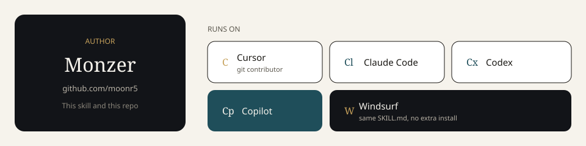

# Contributors

**Author:** [Monzer](https://github.com/moonr5)

Cursor is also a git contributor: commits include `Co-authored-by: Cursor <cursoragent@cursor.com>`. Claude Code, Codex, Copilot, and Windsurf run the same `SKILL.md`. They are hosts, listed here so the repo is not Cursor-only.

| Who | Role | Where it loads |
| --- | --- | --- |
| [Monzer](https://github.com/moonr5) | Author | This repository |
| [Cursor](https://github.com/cursoragent) | Contributor and host | `~/.cursor/skills/monzer/` |
| [Claude Code](https://claude.com/claude-code) | Host | `~/.claude/skills/monzer/` |
| [OpenAI Codex](https://developers.openai.com/codex) | Host | `AGENTS.md` in the product repo |
| [GitHub Copilot](https://github.com/features/copilot) | Host | Custom instructions plus this folder in the repo |
| [Windsurf](https://windsurf.com) | Host | `<repo>/.windsurf/skills/monzer/` |

Any other agent: open the product repo and paste the prompt in [INSTALL.md](INSTALL.md).

Leaf skills under `skills/` belong to their upstream authors. See [ATTRIBUTION.md](ATTRIBUTION.md).
