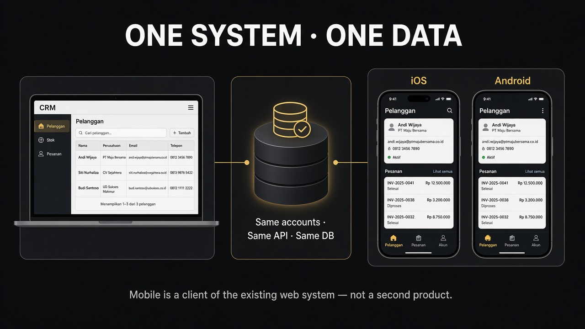
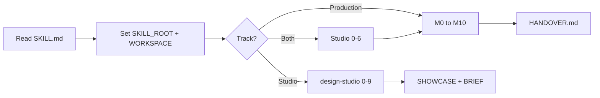
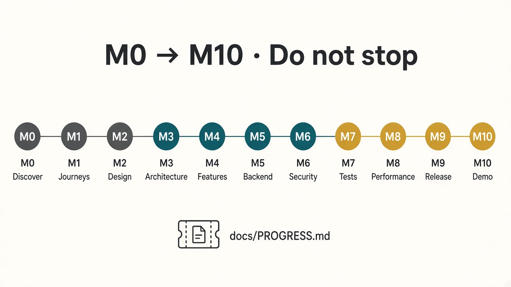
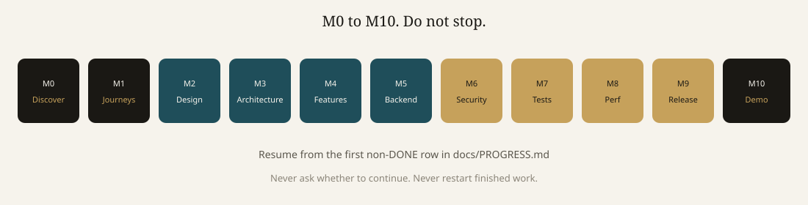
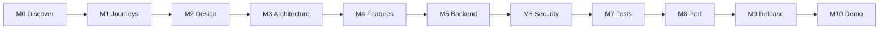
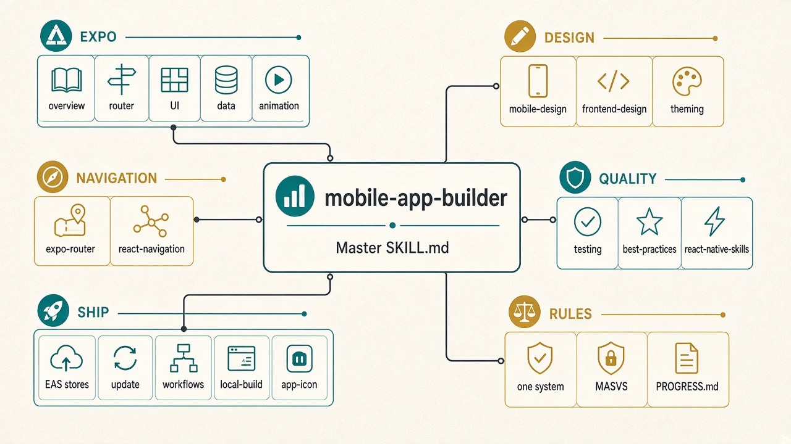
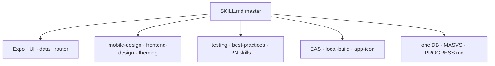
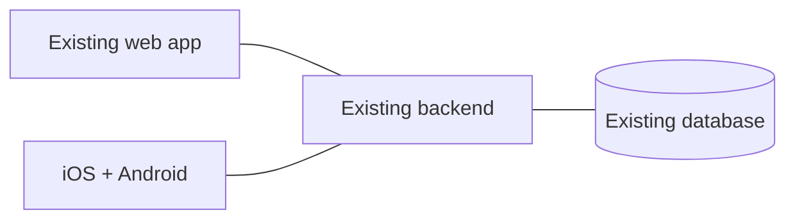

# Mobile App Builder

**One master skill. Two tracks.**

- **Studio** — "make me an app", screens, mockup, prototype. A $26M-class studio. Feeling first. Never the same look twice.
- **Production** — Expo client of your **existing** web system. Same accounts, same API, same database.
- **Both** — unique studio design, then wired to the real backend.

Do not run `npx skills add`. The 23 leaf skills are already inside `skills/`.



<p align="center"></p>

---

## Start in one picture

<p align="center"></p>



**Paste this to any agent** (Cursor, Claude Code, Codex, Copilot):

```
Read this file fully and obey it as the only workflow:
https://raw.githubusercontent.com/moonr5/monzer-mobile-skill/main/SKILL.md

Or clone the repo and set SKILL_ROOT to that folder.
WORKSPACE = this product repo (existing web app + backend).

Execute M0 through M10 without stopping.
Write docs under WORKSPACE/docs/.
```

Install into your own skills folder: see [INSTALL.md](INSTALL.md).

---

## The 11 phases

<p align="center"></p>
<p align="center"></p>



| | What you see | What gets written |
| --- | --- | --- |
| **M0** | The real web system | 6 discovery files |
| **M1** | Who uses the phone, and where | journeys, nav, screens, copy |
| **M2** | A distinctive native design system | tokens + components + gallery |
| **M3** | Auth, API client, offline queue | `ARCHITECTURE.md` |
| **M4** | Every in-scope screen, wired | real backend, no mocks |
| **M5** | Missing mobile APIs | on the **existing** backend |
| **M6** | MASVS review | `SECURITY_REPORT.md` |
| **M7** | Jest + Maestro + web↔phone parity | `TEST_REPORT.md` |
| **M8** | Measured on a mid-range phone | `PERFORMANCE_REPORT.md` |
| **M9** | Stores, OTA, icons | EAS production |
| **M10** | 10-minute CEO demo, 3 clean runs | `HANDOVER.md` |

---

## What is inside this one skill

<p align="center"></p>
<p align="center"></p>



Full visual map with clickable mermaid: [docs/VISUAL.md](docs/VISUAL.md).

---

## Golden rule



- Same login. Same permissions. Changes appear on the other client within seconds.
- No second database. No API keys in the app.
- If mobile needs an endpoint, add it to the existing backend.

---

## Repo map

```
SKILL.md                 ← agents start here
AGENTS.md                ← Codex / AGENTS.md hosts
INSTALL.md               ← Cursor, Claude Code, Copilot
docs/images/             ← posters + SVG diagrams
docs/VISUAL.md           ← interactive mermaid map
references/              ← PROGRESS + deliverable templates
skills/                  ← 23 bundled leaves
```
