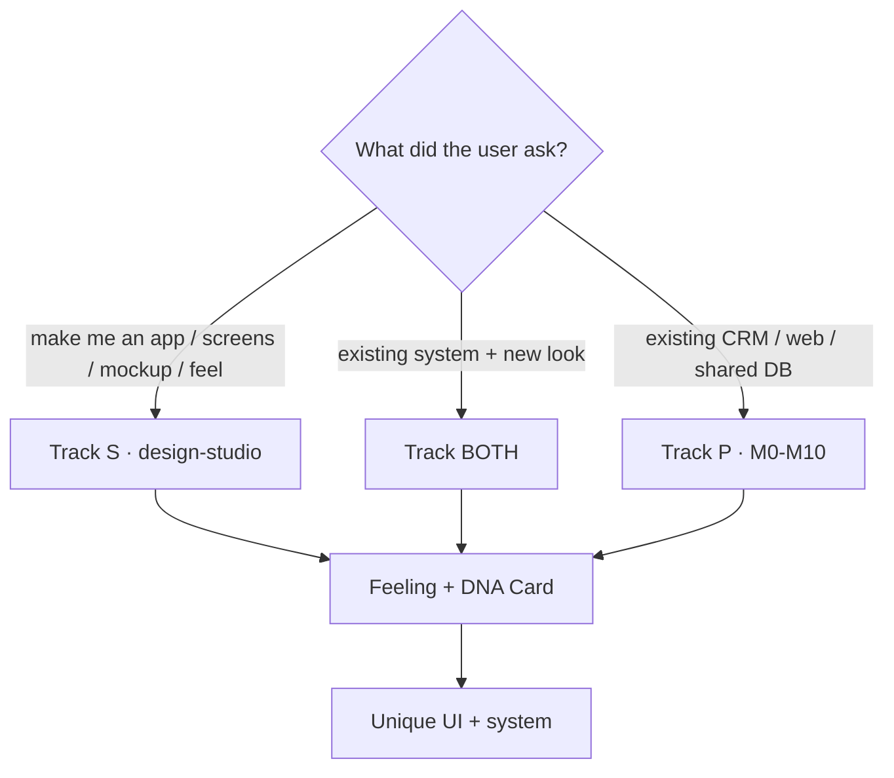
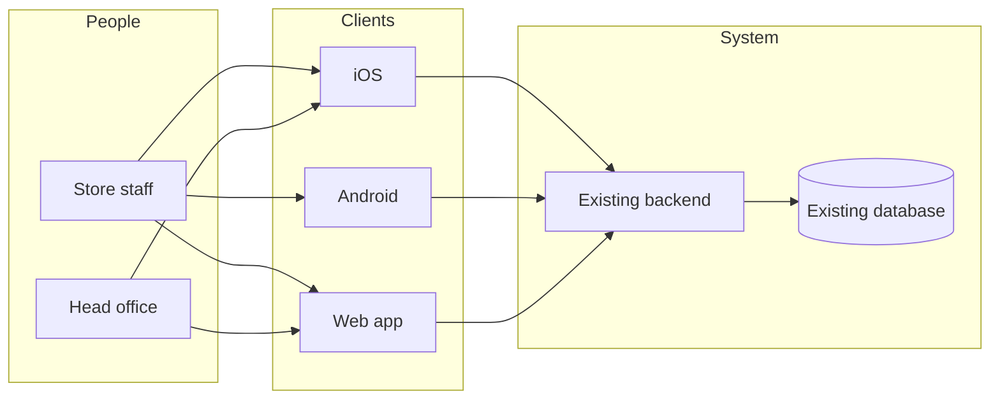
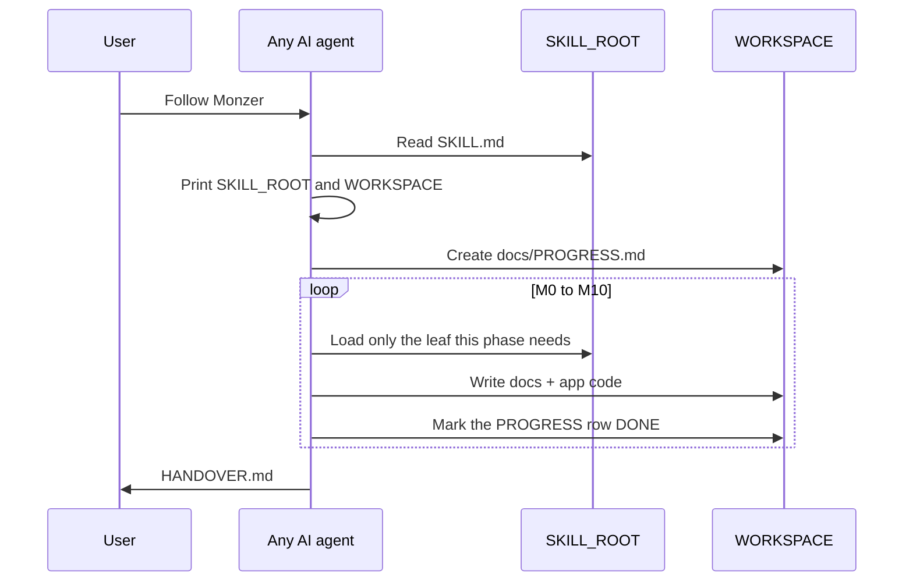
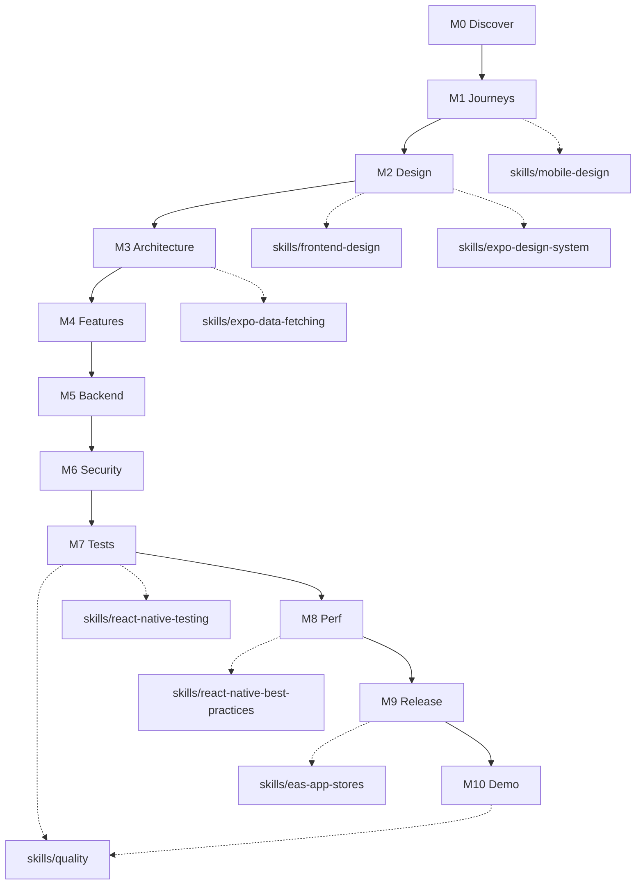
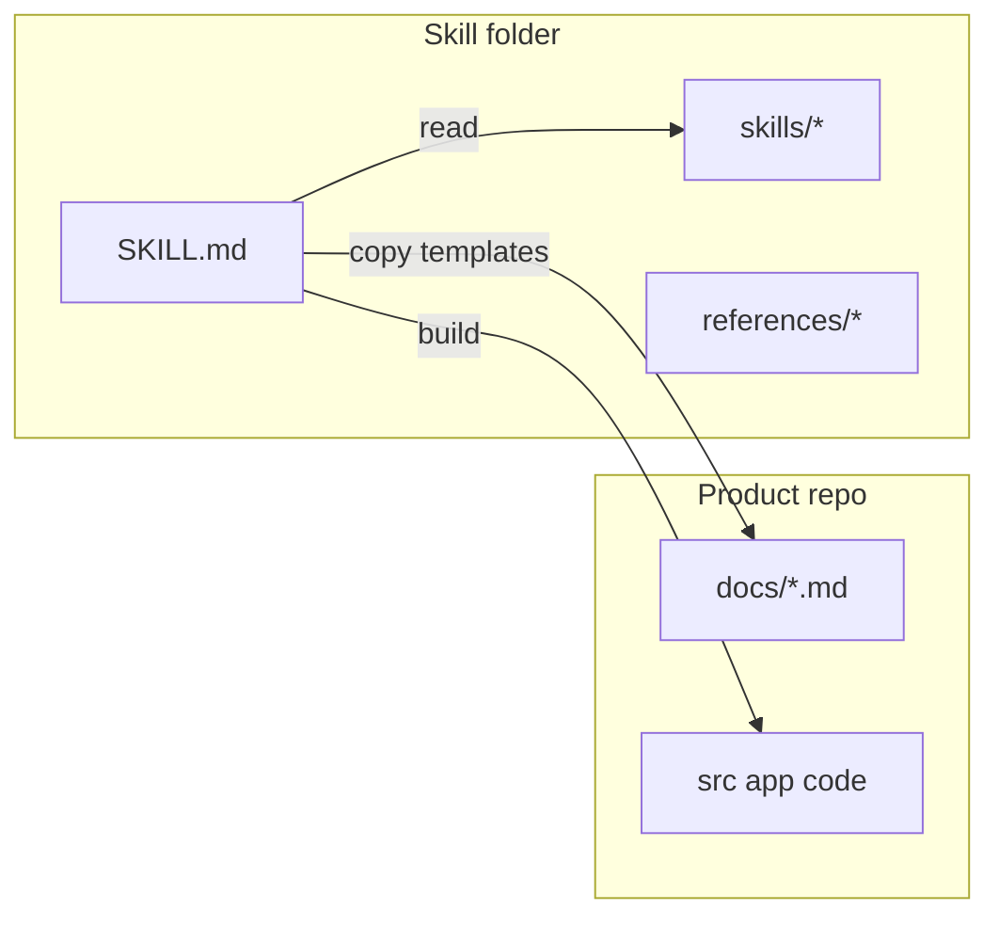
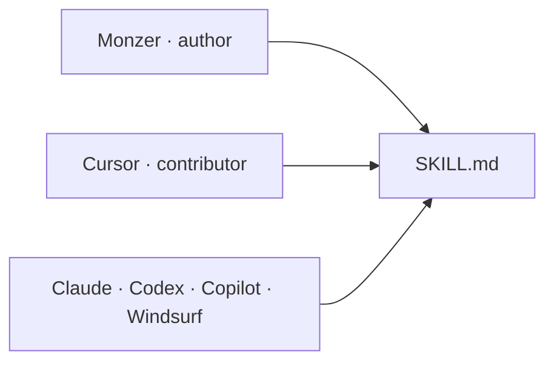

# Visual map

Read the pictures first. Open a leaf only when a phase needs it.

## Which track

## Who talks to what

## Agent session

## Phase → leaf

## Where files go

## Who is credited

Posters live in [images/](images/). Full names: [CONTRIBUTORS.md](../CONTRIBUTORS.md).
